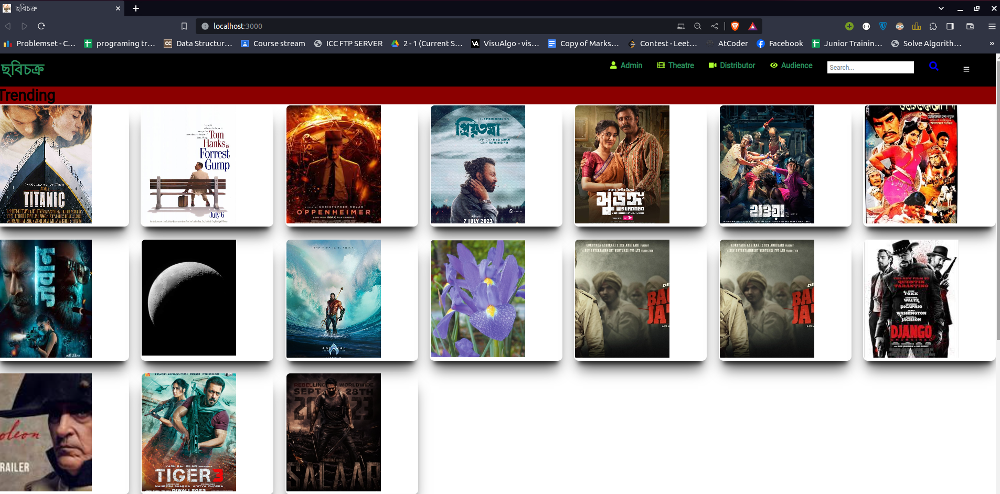

# the-java-fest-chobichokro
The project is about therap java fest

## How to run the python model app

1. to run the project you need to have git lfs installed
2. clone the project
3. install python3 and pip3
4. go to sentiment_analysis folder
5. install the requirements in the need.txt file using ``` pip install -r need.txt ```
6. run the python app using ``` python app.py ```

## How to run the spring boot app
1. install java 17
2. install maven
3. go to the spring-boot-app folder
4. run the app using ``` mvn spring-boot:run ```
5. the app will run on port 8080



## Chobichokro for Therap Java Fest 2023 ##

# **Chobichokro**

[](https://opensource.org/licenses/)

[](https://opensource.org/licenses/)
[](https://opensource.org/licenses/)


Chobichokro is a web application that will intrigate the distributor , theater ownder and audience in a single platform. It is a platform where distributor can upload their movies and theater owner can book the movies for their theater. Audience can see the movies and book the tickets for their favorite movies. The Theater owner can also see the booking status of their movie reels.


## Tech Stack

**Server:**

- Spring boot 3
- Spring Security
- Spring Data JPA
- Spring Mail
- JWT
- Maven
- Swagger
- Lombok
- python 3.10
- pytorch 1.9
- flask 2.0
- RobertaForSequenceClassification

**Data Base:**

- MongoDB

## REST API Documentation

## License

[MIT](https://choosealicense.com/licenses/mit/)


