# the-java-fest-chobichokro
The project is about therap java fest
## The front end of the project is [Chobichokro](https://github.com/khalid-shohag/chobichokro/)

## How to run the python model app

1. to run the project you need to have git lfs installed
2. clone the project
3. install python3 and pip3
4. go to sentiment_analysis folder
5. install the requirements in the need.txt file using ``` pip install -r need.txt ```
6. run the python app using ``` python app.py ```

## How to run the spring boot app
1. install java 17
2. install maven
3. go to the spring-boot-app folder
4. run the app using ``` mvn spring-boot:run ```
5. the app will run on port 8080

## Chobichokro for Therap Java Fest 2023 ##

# **Chobichokro**

[](https://opensource.org/licenses/)

[](https://opensource.org/licenses/)
[](https://opensource.org/licenses/)


##### The Chobichokro Web App is a comprehensive platform that aims to streamline the movie distribution and theater management process within the Bangladeshi film industry. This web app will facilitate interactions among distributors, theater owners, and audiences, providing an efficient and user-friendly way to manage movie releases, ticket bookings, financial transactions, and performance analysis. #
# Screenshot of Chobichokro #
## home page ##
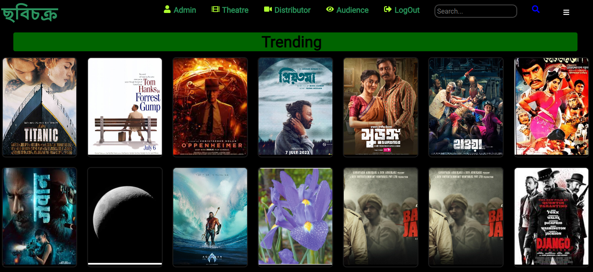

## search result actor ##
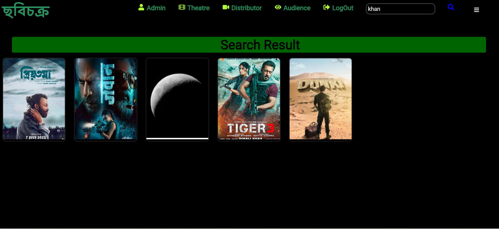

## search result genre ##

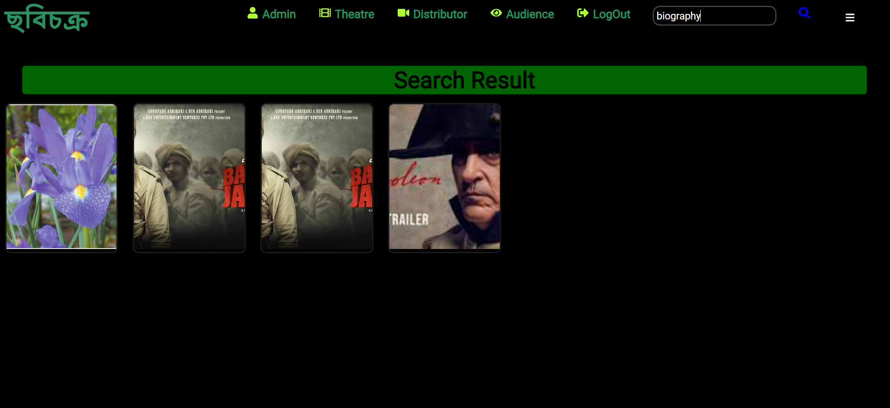

## search result movie name ##
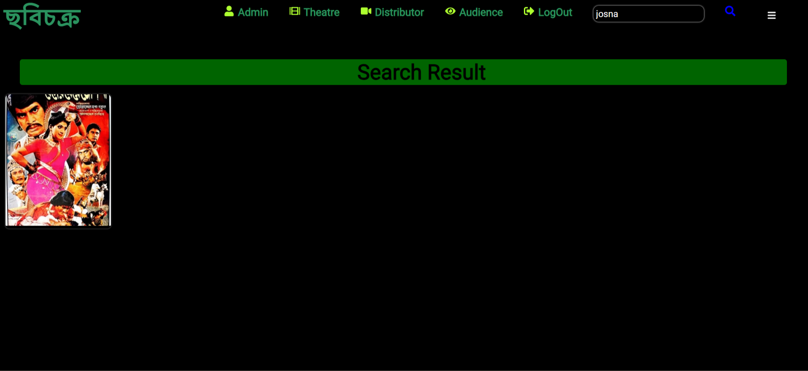

## seat booking request ##
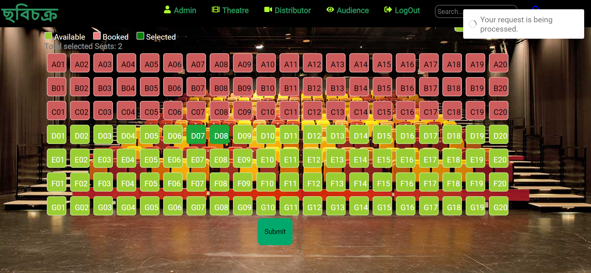

## seat booking confirmation ##
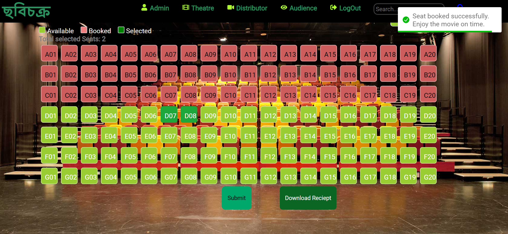

## Audience dashboard ##
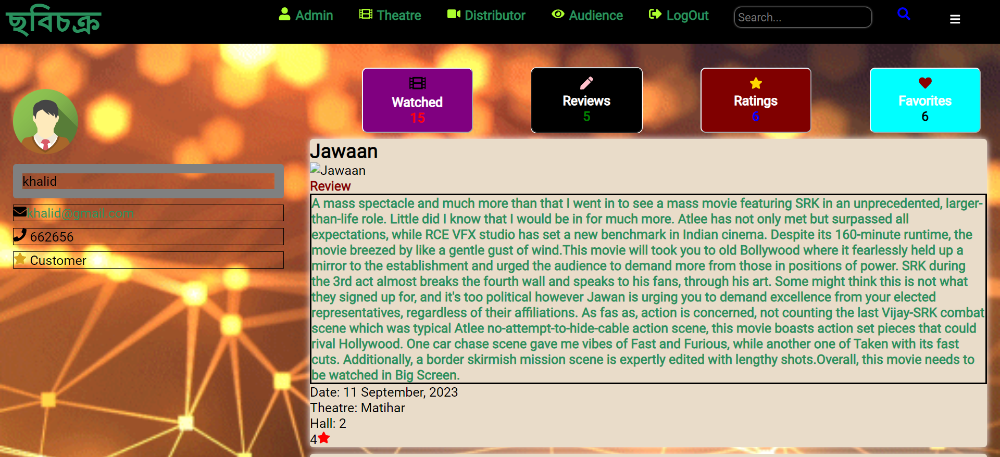

## Movie review ##
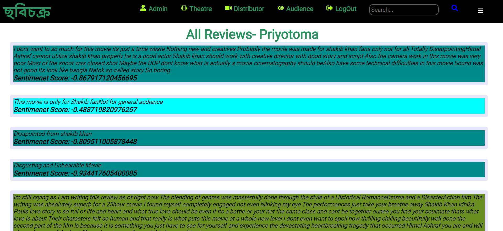

## review adding ##
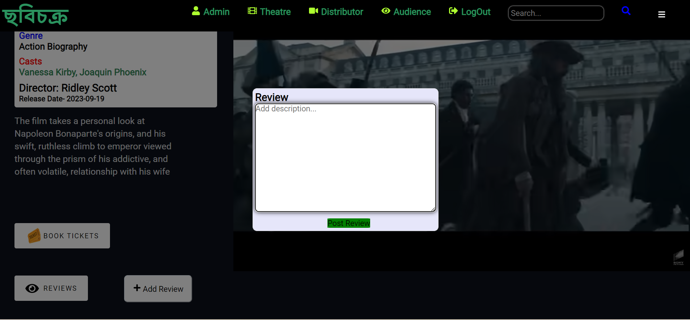

## distributor movie info ##
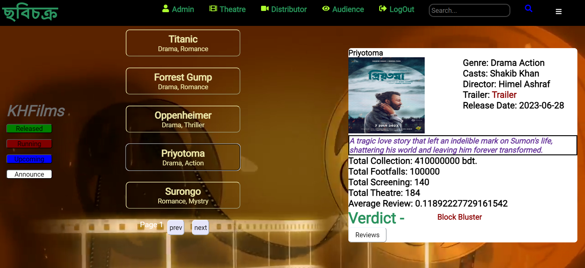

## License request form ##
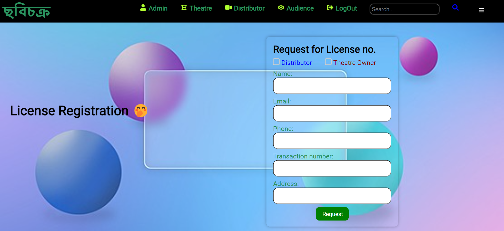

## Admin tax information ## 
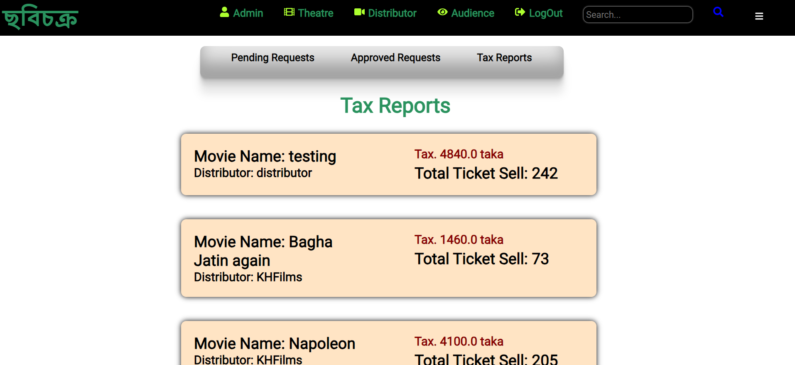


## Tech Stack

**Server:**

- Spring boot 3
- Spring Security
- Spring Data JPA
- Spring Mail
- JWT
- Maven
- Swagger
- Lombok
- python 3.10
- pytorch 1.9
- flask 2.0
- RobertaForSequenceClassification


**Data Base:**

- MongoDB

## REST API Documentation
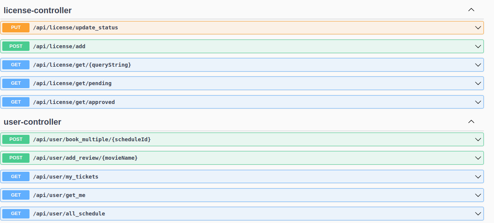
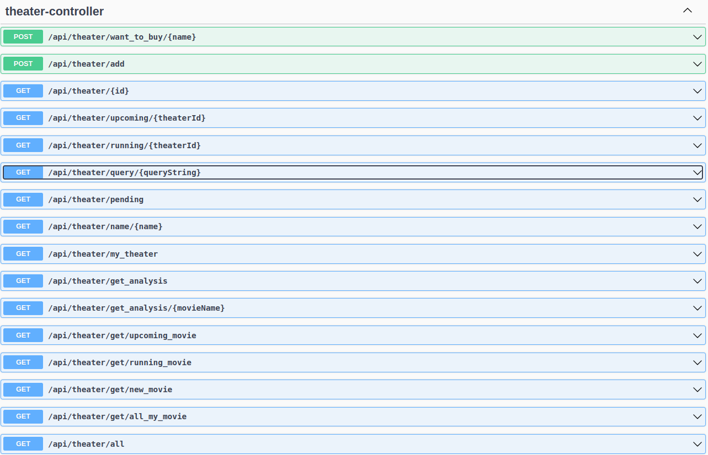

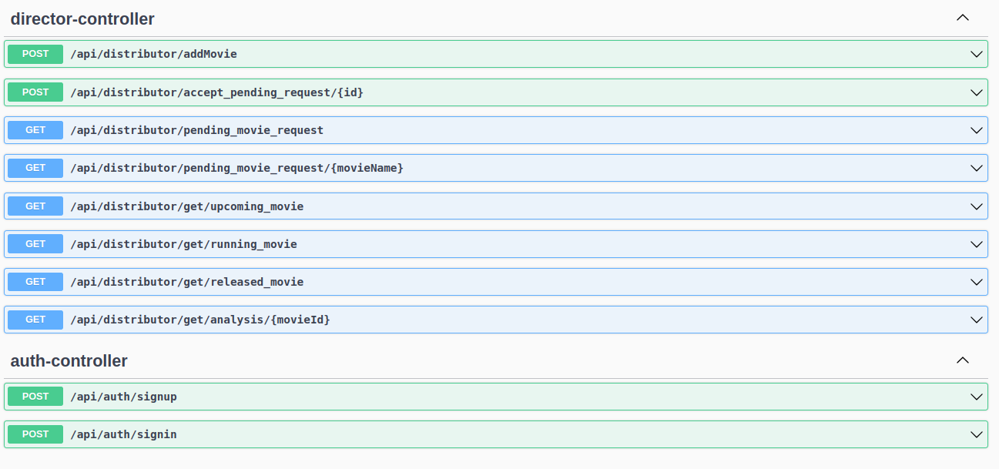
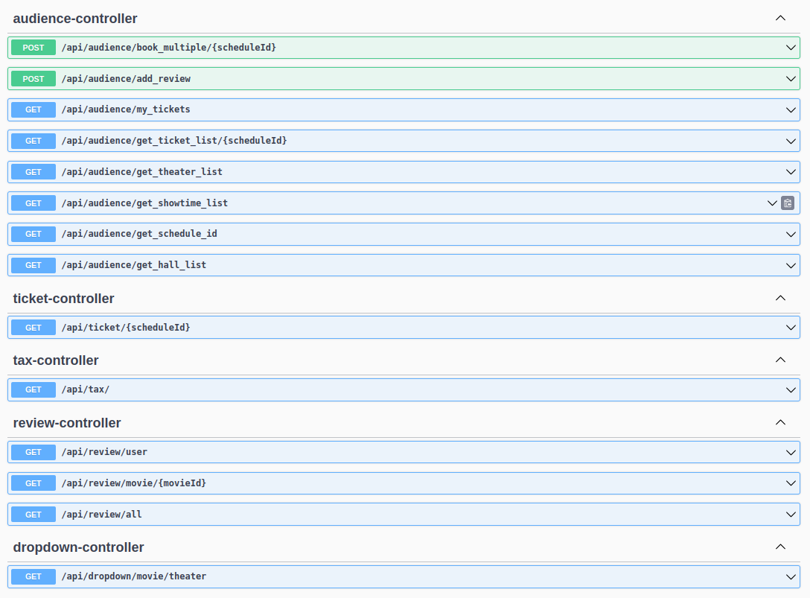
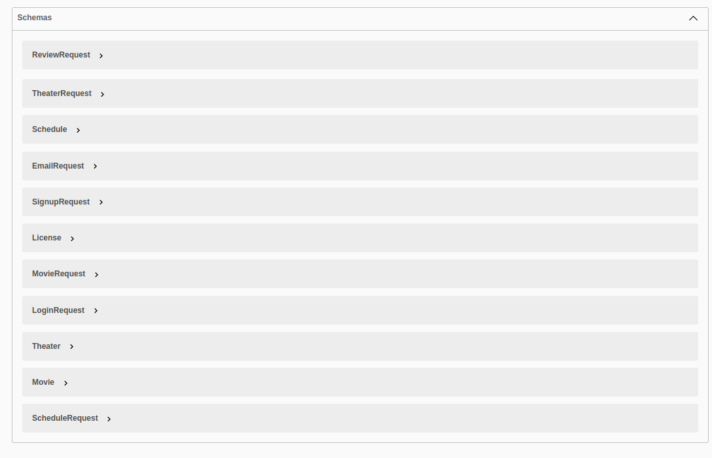
|
## Project Structure
```
backend
├─ .git
│  ├─ config
│  ├─ description
├─ .gitattributes
├─ .gitignore
├─ .mvn
│  └─ wrapper
│     ├─ maven-wrapper.jar
│     ├─ maven-wrapper.properties
│     └─ MavenWrapperDownloader.java
├─ images
├─ LICENSE
├─ mvnw
├─ mvnw.cmd
├─ pom.xml
├─ qodana.yaml
├─ README.md
├─ Sentiment-Alanizer-Model
│  ├─ app.py
│  ├─ model
│  │  ├─ config.json
│  │  ├─ gitattributes.txt
│  │  ├─ merges.txt
│  │  ├─ pytorch_model.bin
│  │  ├─ README.md
│  │  ├─ special_tokens_map.json
│  │  └─ vocab.json
│  └─ need.txt
└─ src
├─ main
│  ├─ java
│  │  └─ com
│  │     └─ chobichokro
│  │        ├─ ChobiChokroApi.java
│  │        ├─ controllerHelper
│  │        │  ├─ AudienceHelper.java
│  │        │  ├─ DirectorHelper.java
│  │        │  ├─ Helper.java
│  │        │  ├─ TheaterHelper.java
│  │        │  ├─ TicketHelper.java
│  │        │  └─ UserHelper.java
│  │        ├─ controllers
│  │        │  ├─ AudienceController.java
│  │        │  ├─ AuthController.java
│  │        │  ├─ DirectorController.java
│  │        │  ├─ DropdownController.java
│  │        │  ├─ LicenseController.java
│  │        │  ├─ MailController.java
│  │        │  ├─ MovieController.java
│  │        │  ├─ ReviewController.java
│  │        │  ├─ ScheduleController.java
│  │        │  ├─ TaxController.java
│  │        │  ├─ TestController.java
│  │        │  ├─ TheaterController.java
│  │        │  ├─ TicketController.java
│  │        │  └─ UserController.java
│  │        ├─ impl
│  │        │  ├─ EmailServiceImpl.java
│  │        │  └─ FileServicesImpl.java
│  │        ├─ models
│  │        │  ├─ ERole.java
│  │        │  ├─ License.java
│  │        │  ├─ Movie.java
│  │        │  ├─ OTP.java
│  │        │  ├─ Review.java
│  │        │  ├─ Role.java
│  │        │  ├─ Schedule.java
│  │        │  ├─ Tax.java
│  │        │  ├─ Theater.java
│  │        │  ├─ Ticket.java
│  │        │  └─ User.java
│  │        ├─ payload
│  │        │  ├─ request
│  │        │  │  ├─ EmailRequest.java
│  │        │  │  ├─ LoginRequest.java
│  │        │  │  ├─ MovieRequest.java
│  │        │  │  ├─ ReviewRequest.java
│  │        │  │  ├─ ScheduleRequest.java
│  │        │  │  ├─ SignupRequest.java
│  │        │  │  └─ TheaterRequest.java
│  │        │  └─ response
│  │        │     ├─ DirectorAnalysis.java
│  │        │     ├─ DistributorMovieResponse.java
│  │        │     ├─ JwtResponse.java
│  │        │     ├─ MessageResponse.java
│  │        │     ├─ MovieAnalysis.java
│  │        │     ├─ MovieResponse.java
│  │        │     ├─ MyMovieResponse.java
│  │        │     ├─ PendingResponses.java
│  │        │     └─ ScheduleResponse.java
│  │        ├─ relation
│  │        │  ├─ TheaterMoviePending.java
│  │        │  ├─ TheaterMovieRelation.java
│  │        │  ├─ TheaterNewMovieRelation.java
│  │        │  └─ TheaterOwnerMovieRelation.java
│  │        ├─ relationRepository
│  │        │  ├─ TheaterMoviePendingRepository.java
│  │        │  ├─ TheaterMovieRelationRepository.java
│  │        │  ├─ TheaterNewMovieRelationRepository.java
│  │        │  └─ TheaterOwnerMovieRelationRepository.java
│  │        ├─ repository
│  │        │  ├─ LicenseRepository.java
│  │        │  ├─ MovieRepository.java
│  │        │  ├─ OTPRepository.java
│  │        │  ├─ ReviewRepository.java
│  │        │  ├─ RoleRepository.java
│  │        │  ├─ ScheduleRepository.java
│  │        │  ├─ TaxRepository.java
│  │        │  ├─ TheaterRepository.java
│  │        │  ├─ TicketRepository.java
│  │        │  └─ UserRepository.java
│  │        ├─ security
│  │        │  ├─ jwt
│  │        │  │  ├─ AuthEntryPointJwt.java
│  │        │  │  ├─ AuthTokenFilter.java
│  │        │  │  └─ JwtUtils.java
│  │        │  ├─ services
│  │        │  │  ├─ UserDetailsImpl.java
│  │        │  │  └─ UserDetailsServiceImpl.java
│  │        │  └─ WebSecurityConfig.java
│  │        └─ services
│  │           ├─ EmailService.java
│  │           └─ FileServices.java
│  └─ resources
│     └─ application.properties
└─ test
└─ java
└─ com
└─ chobichokro
└─ ChobiChokroApiTests.java

```
## License

[MIT](https://choosealicense.com/licenses/mit/)

##  Contributor ##
[@khalid-shohag](https://github.com/khalid-shohag)
[@Kamol-Paul](https://github.com/Kamol-Paul)

