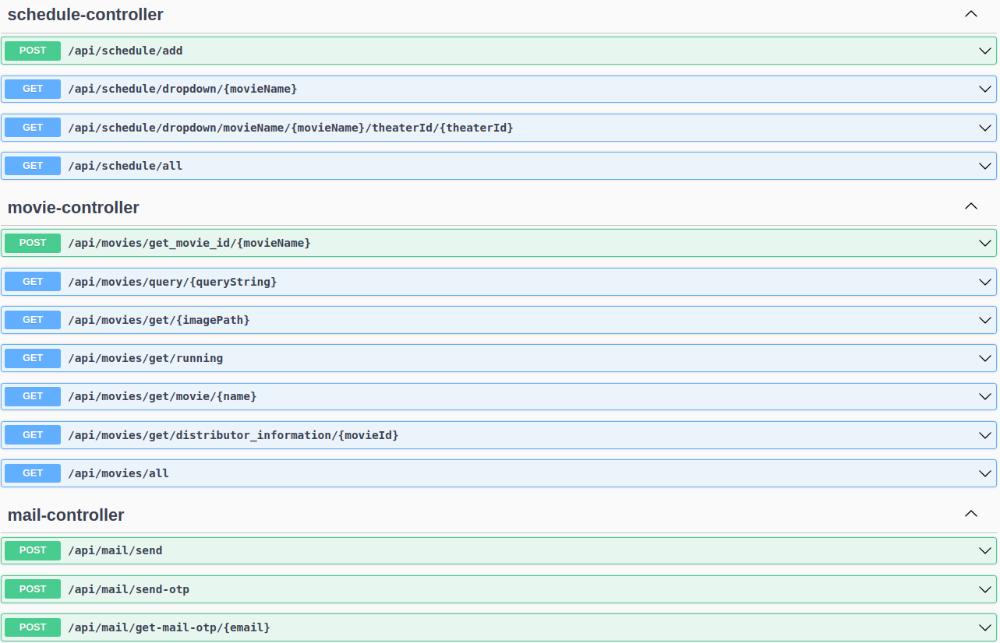

# the-java-fest-chobichokro
The project is about therap java fest
## The front end of the project is [Chobichokro](https://github.com/khalid-shohag/chobichokro/)

## How to run the python model app

1. to run the project you need to have git lfs installed
2. clone the project
3. install python3 and pip3
4. go to sentiment_analysis folder
5. install the requirements in the need.txt file using ``` pip install -r need.txt ```
6. run the python app using ``` python app.py ```

## How to run the spring boot app
1. install java 17
2. install maven
3. go to the spring-boot-app folder
4. run the app using ``` mvn spring-boot:run ```
5. the app will run on port 8080

## Chobichokro for Therap Java Fest 2023 ##

# **Chobichokro**

[](https://opensource.org/licenses/)

[](https://opensource.org/licenses/)
[](https://opensource.org/licenses/)


The movie industry in Bangladesh has undergone significant transformations over the years, shaped by
a multitude of factors including technological advancements, changing audience preferences and economic
dynamics. While it is true that the Bangladesh movie industry has faced challenges related to box office revenues and tax compliance, it is essential to acknowledge the broader context that contributes to this situation.
The Chobichokro Web App is a comprehensive platform that aims to streamline the movie distribution
and theater management process within the Bangladeshi film industry. This web app will facilitate interactions among distributors, theater owners, and audiences, providing an efficient and user-friendly way to
manage movie releases, ticket bookings, financial transactions, and performance analysis.

# Screenshot of Chobichokro #
## home page ##


## search result actor ##


## search result genre ##


## search result movie name ##


## seat booking request ##


## seat booking confirmation ##


## Audience dashboard ##


## Movie review ##


## review adding ##


## distributor movie info ##


## License request form ##


## Admin tax information ## 


## Tech Stack

**Server:**

- Spring boot 3
- Spring Security
- Spring Data JPA
- Spring Mail
- JWT
- Maven
- Swagger
- Lombok
- python 3.10
- pytorch 1.9
- flask 2.0
- RobertaForSequenceClassification
**Frontend**
- react
- 
**Data Base:**

- MongoDB

## REST API Documentation





|
## Project Structure
```
chobichokro-api
            image
            Sentiment Analyzer model
                model
                    RobertaModelForSequentialClassification
                app.py
            src/main/java/com/chobichokro
                                controller
                                    AudienceController
                                    AuthController
                                    DirectorController
                                    DropdownController
                                    LicenseController
                                    MailController
                                    MovieController
                                    ReviewController
                                    ScheduleController
                                    TaxController
                                    TheaterController
                                    TicketController
                                    UserController
                                controllerHelper
                                    AudienceHelper
                                    DirectorHelper
                                    Helper
                                    TheaterHelper
                                    TicketHelper
                                    UserHelper
                                impl
                                    EmailServiceImpl
                                    FileServiceImpl
                                models
                                    Erole
                                    Licenese
                                    Movie
                                    OTP
                                    Review
                                    Role
                                    Schedule
                                    Tax
                                    Theater
                                    Ticket
                                    User
                                payload
                                    Request
                                        EmailRequest
                                        LoginRequest
                                        MovieRequest
                                        ReviewRequest
                                        ScheduleRequest
                                        SignupRequest
                                        TheaterRequest
                                    Response
                                        DirectorAnalysis
                                        DistributorMovieResponse
                                        JwtResponse
                                        MessageResponse
                                        MovieAnalysis
                                        MyMovieResponse
                                        PendingResponse
                                        ScheduleResponse  
                                relation
                                    TheaterMoviePending
                                    TheaterMovieRelation
                                    TheaterNewMovieRelation
                                    TheaterOnwerMovieRelation
                                relationRepository
                                    TheaterMoviePendingRepository
                                    TheaterMovieRelationRepository
                                    TheaterNewMovieRelationRepository
                                    TheaterOnwerMovieRelationRepository

                                repository
                                    EroleRepository
                                    LiceneseRepository
                                    MovieRepository
                                    OTPRepository
                                    ReviewRepository
                                    RoleRepository
                                    ScheduleRepository
                                    TaxRepository
                                    TheaterRepository
                                    TicketRepository
                                    UserRepository
                                security
                                    jwt
                                        AuthEntryPonitJwt
                                        AuthTokenFilter
                                        JwtUtils
                                    servies
                                        UserDetailsImpl
                                        UserDetailsServiceImpl

```
## License

[MIT](https://choosealicense.com/licenses/mit/)

##  Contributor ##
[@khalid-shohag](https://github.com/khalid-shohag)
[@Kamol-Paul](https://github.com/Kamol-Paul)

